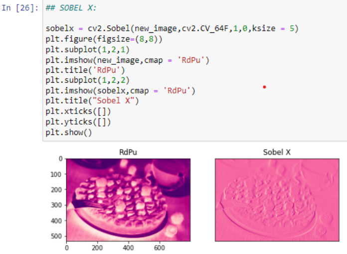

# Edge-Detection
## Aim:
To perform edge detection using Sobel, Laplacian, and Canny edge detectors.

## Software Required:
Anaconda - Python 3.7

## Algorithm:
### Step1:
<br>


### Step2:
<br>

### Step3:
<br>

### Step4:
<br>

### Step5:
<br>

 Developed by: P.Sarveshvaran
 Register number: 212221230090
## Program:

``` Python
# ORIGINAL IMAGE:
import numpy as np
import cv2
import matplotlib.pyplot as plt
input_image = cv2.imread("berrypie.jpg")
input_image = cv2.cvtColor(input_image,cv2.COLOR_BGR2RGB)
plt.axis('off')
plt.imshow(input_image)
plt.show()

# SOBEL EDGE DETECTOR

#Sobal X:
sobelx = cv2.Sobel(new_image,cv2.CV_64F,1,0,ksize = 5)
plt.figure(figsize=(8,8))
plt.subplot(1,2,1)
plt.imshow(new_image,cmap = 'RdPu')
plt.title('RdPu')
plt.subplot(1,2,2)
plt.imshow(sobelx,cmap = 'RdPu')
plt.title("Sobel X")
plt.xticks([])
plt.yticks([])
plt.show()


#Sobel Y:
sobely = cv2.Sobel(new_image,cv2.CV_64F,0,1,ksize = 5)
plt.figure(figsize = (8,8))
plt.subplot(1,2,1)
plt.imshow(new_image,cmap = 'OrRd')
plt.title('OrRd')
plt.subplot(1,2,2)
plt.imshow(sobely,cmap = 'OrRd')
plt.title("Sobel Y")
plt.xticks([])
plt.yticks([])
plt.show()


#Sobel XY:
sobelxy = cv2.Sobel(new_image,cv2.CV_64F,1,1,ksize=5)
plt.figure(figsize = (8,8))
plt.subplot(1,2,1)
plt.imshow(new_image,cmap = 'BuPu')
plt.title('BuPu')
plt.subplot(1,2,2)
plt.imshow(sobelxy,cmap = 'BuPu')
plt.title('Sobel XY')
plt.xticks([])
plt.yticks([])
plt.show()

#LAPLACIAN EDGE DETECTOR:
laplacian = cv2.Laplacian(new_image,cv2.CV_64F)
plt.figure(figsize = (8,8))
plt.subplot(1,2,1)
plt.imshow(new_image,cmap = 'bone')
plt.title('bone')
plt.subplot(1,2,2)
plt.imshow(laplacian,cmap = 'bone')
plt.title('Laplacian')
plt.xticks([])
plt.yticks([])
plt.show()

#CANNY EDGE DETECTOR
canny_edge = cv2.Canny(new_image,120,150)
plt.figure(figsize = (8,8))
plt.subplot(1,2,1)
plt.imshow(new_image,cmap = 'gist_gray')
plt.title('gist_gray')
plt.subplot(1,2,2)
plt.imshow(canny_edge,cmap = 'gist_gray')
plt.title('Canny Edges')
plt.xticks([])
plt.yticks([])
plt.show()


```
## Output:




## Result:
Thus the edges are detected using Sobel, Laplacian, and Canny edge detectors.
